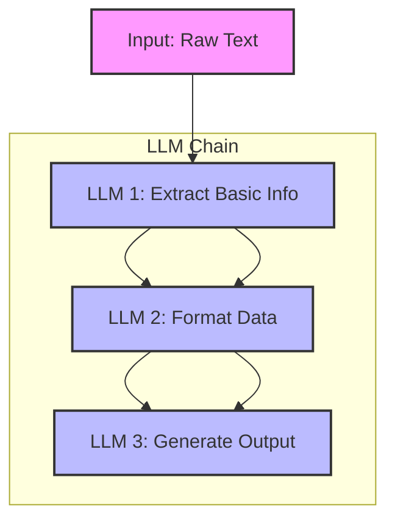
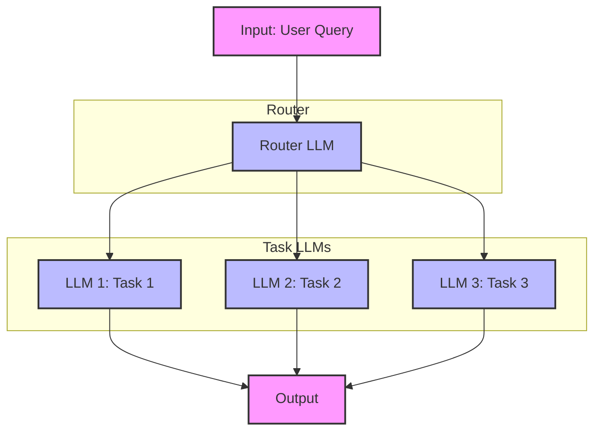
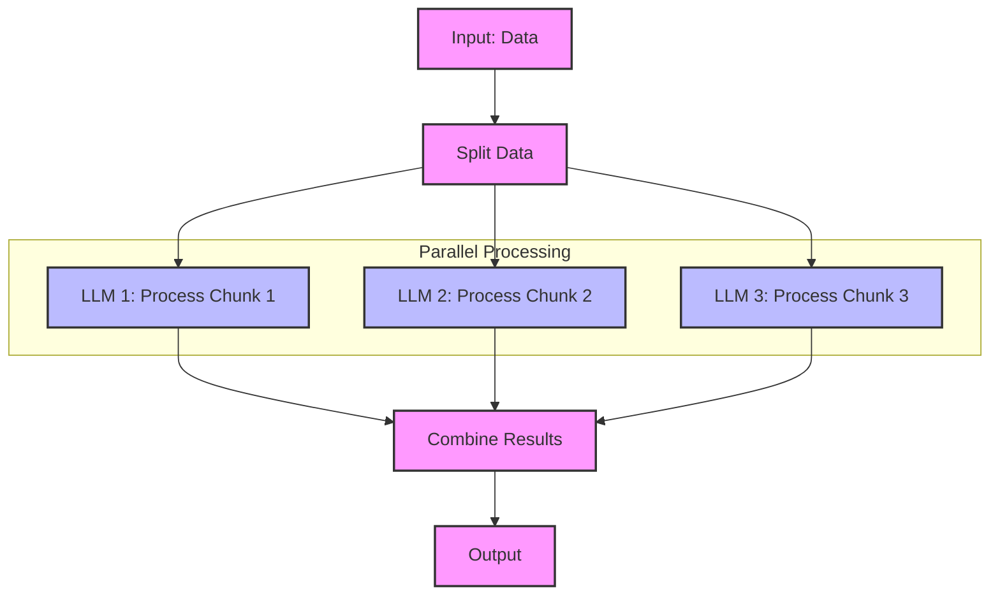
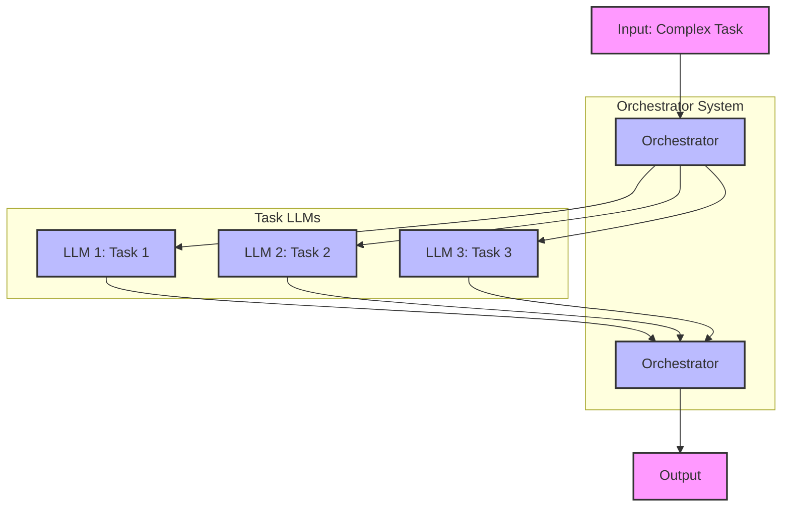

# AI Workflow Patterns

## 1. Prompt Chaining

```mermaid
graph TD
    A[Input: Raw Text] --> B[LLM 1: Extract Basic Info]
    B --> C[LLM 2: Format Data]
    C --> D[LLM 3: Generate Output]
    
    style A fill:#f9f,stroke:#333,stroke-width:2px
    style B fill:#bbf,stroke:#333,stroke-width:2px
    style C fill:#bbf,stroke:#333,stroke-width:2px
    style D fill:#bbf,stroke:#333,stroke-width:2px
    
    subgraph LLM Chain
        B --> C --> D
    end
    
    classDef default fill:#f9f,stroke:#333,stroke-width:2px
    classDef llm fill:#bbf,stroke:#333,stroke-width:2px
    class B,C,D llm
```

## 2. Routing

```mermaid
graph TD
    A[Input: User Query] --> B[Router LLM]
    B --> C[LLM 1: Task 1]
    B --> D[LLM 2: Task 2]
    B --> E[LLM 3: Task 3]
    
    C --> F[Output]
    D --> F
    E --> F
    
    style A fill:#f9f,stroke:#333,stroke-width:2px
    style B fill:#bbf,stroke:#333,stroke-width:2px
    style C fill:#bbf,stroke:#333,stroke-width:2px
    style D fill:#bbf,stroke:#333,stroke-width:2px
    style E fill:#bbf,stroke:#333,stroke-width:2px
    style F fill:#f9f,stroke:#333,stroke-width:2px
    
    subgraph Router
        B
    end
    
    subgraph Task LLMs
        C
        D
        E
    end
    
    classDef default fill:#f9f,stroke:#333,stroke-width:2px
    classDef llm fill:#bbf,stroke:#333,stroke-width:2px
    class B,C,D,E llm
```

## 3. Parallelization

```mermaid
graph TD
    A[Input: Data] --> B[Split Data]
    B --> C[LLM 1: Process Chunk 1]
    B --> D[LLM 2: Process Chunk 2]
    B --> E[LLM 3: Process Chunk 3]
    
    C --> F[Combine Results]
    D --> F
    E --> F
    
    F --> G[Output]
    
    style A fill:#f9f,stroke:#333,stroke-width:2px
    style B fill:#f9f,stroke:#333,stroke-width:2px
    style C fill:#bbf,stroke:#333,stroke-width:2px
    style D fill:#bbf,stroke:#333,stroke-width:2px
    style E fill:#bbf,stroke:#333,stroke-width:2px
    style F fill:#f9f,stroke:#333,stroke-width:2px
    style G fill:#f9f,stroke:#333,stroke-width:2px
    
    subgraph Parallel Processing
        C
        D
        E
    end
    
    classDef default fill:#f9f,stroke:#333,stroke-width:2px
    classDef llm fill:#bbf,stroke:#333,stroke-width:2px
    class C,D,E llm
```

## 4. Orchestrator

```mermaid
graph TD
    A[Input: Complex Task] --> B[Orchestrator]
    
    B --> C[LLM 1: Task 1]
    B --> D[LLM 2: Task 2]
    B --> E[LLM 3: Task 3]
    
    C --> F[Orchestrator]
    D --> F
    E --> F
    
    F --> G[Output]
    
    style A fill:#f9f,stroke:#333,stroke-width:2px
    style B fill:#bbf,stroke:#333,stroke-width:2px
    style C fill:#bbf,stroke:#333,stroke-width:2px
    style D fill:#bbf,stroke:#333,stroke-width:2px
    style E fill:#bbf,stroke:#333,stroke-width:2px
    style F fill:#bbf,stroke:#333,stroke-width:2px
    style G fill:#f9f,stroke:#333,stroke-width:2px
    
    subgraph Orchestrator System
        B
        F
    end
    
    subgraph Task LLMs
        C
        D
        E
    end
    
    classDef default fill:#f9f,stroke:#333,stroke-width:2px
    classDef llm fill:#bbf,stroke:#333,stroke-width:2px
    class B,C,D,E,F llm
```
